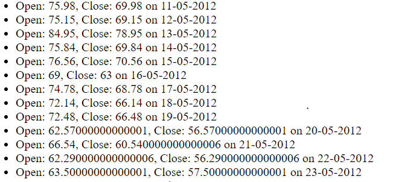
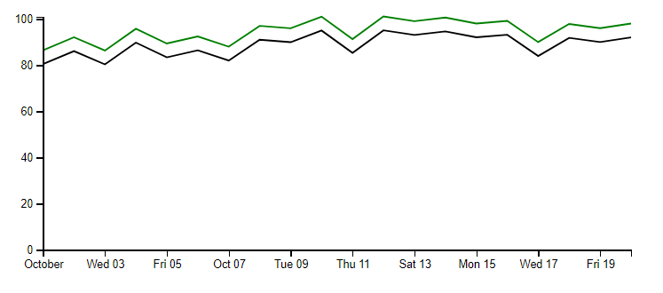

Follow these instructions to run this sample:

### Server
Open a command prompt and move to the server folder. Install the packages using `npm install` command. Start the server using `node index.js` command. The server exposes an API end point that serves the current state of the market. The server also starts a socket IO connection to send the updates of the market in real time.

Once the server starts, visit the URL http://localhost:3000 to see how the data is served from socket IO. It looks like the following:

### Client
The client is an Angular application built using Angular CLI. The client consumes the data from the server API and the socket IO endpoint. This data of last 20 days is plotted on a d3 multi line chart. This chart gets updated whenever it receives a new piece of data from the server.

To setup the client application, open a command prompt and move to the client folder. Run `npm install` to install the packages required for the client application and run `npm start` to start the application. Once the webpack dev server starts, you can visit the URL http://localhost:4200 to see the application. The following screenshot shows a sample output of this application:

